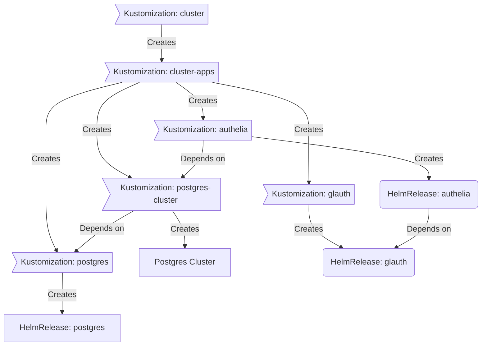

<div align="center">


### My Home Operations Repository

_... managed with Flux, Renovate, and GitHub Actions_ 🤖

</div>

<div align="center">

<!-- [](https://www.talos.dev/)&nbsp;&nbsp;
[](https://www.talos.dev/)&nbsp;&nbsp;
[](https://gitlab.monosense.io/iac/prod-ops/actions/workflows/renovate.yaml) -->

</div>

<div align="center">

<!-- [](https://status.monosense.io)&nbsp;&nbsp;
[](https://status.monosense.io)&nbsp;&nbsp;
[](https://status.monosense.io)
 -->
</div>

<div align="center">

<!-- [](https://github.com/kashalls/kromgo/)&nbsp;&nbsp;
[](https://github.com/kashalls/kromgo/)&nbsp;&nbsp;
[](https://github.com/kashalls/kromgo/)&nbsp;&nbsp;
[](https://github.com/kashalls/kromgo/)&nbsp;&nbsp;
[](https://github.com/kashalls/kromgo/)&nbsp;&nbsp;
[](https://github.com/kashalls/kromgo/)&nbsp;&nbsp;
[](https://github.com/kashalls/kromgo/) -->

</div>

---

## 📖 Overview

This is a mono repository for my home infrastructure and Kubernetes cluster. I try to adhere to Infrastructure as Code (IaC) and GitOps practices using tools like [Ansible](https://www.ansible.com/), [Terraform](https://www.terraform.io/), [Kubernetes](https://kubernetes.io/), [Flux](https://github.com/fluxcd/flux2), [Renovate](https://github.com/renovatebot/renovate), and [GitHub Actions](https://github.com/features/actions).

---

## ⛵ Kubernetes

My Kubernetes cluster is deploy with [Talos](https://www.talos.dev). This is a semi-hyper-converged cluster, workloads and block storage are sharing the same available resources on my nodes while I have a separate server with ZFS for NFS/SMB shares, bulk file storage and backups.

There is a template over at [onedr0p/cluster-template](https://github.com/onedr0p/cluster-template) if you want to try and follow along with some of the practices I use here.

### Core Components

- [actions-runner-controller](https://github.com/actions/actions-runner-controller): Self-hosted Github runners.
- [cert-manager](https://github.com/cert-manager/cert-manager): Creates SSL certificates for services in my cluster.
- [cilium](https://github.com/cilium/cilium): Internal Kubernetes container networking interface.
- [cloudflared](https://github.com/cloudflare/cloudflared): Enables Cloudflare secure access to certain ingresses.
- [external-dns](https://github.com/kubernetes-sigs/external-dns): Automatically syncs ingress DNS records to a DNS provider.
- [external-secrets](https://github.com/external-secrets/external-secrets): Managed Kubernetes secrets using [1Password Connect](https://github.com/1Password/connect).
- [ingress-nginx](https://github.com/kubernetes/ingress-nginx): Kubernetes ingress controller using NGINX as a reverse proxy and load balancer.
- [rook](https://github.com/rook/rook): Distributed block storage for peristent storage.
- [sops](https://github.com/getsops/sops): Managed secrets for Kubernetes and Terraform which are commited to Git.
- [spegel](https://github.com/spegel-org/spegel): Stateless cluster local OCI registry mirror.
- [volsync](https://github.com/backube/volsync): Backup and recovery of persistent volume claims.

### GitOps

[Flux](https://github.com/fluxcd/flux2) watches the clusters in my [kubernetes](./kubernetes/) folder (see Directories below) and makes the changes to my clusters based on the state of my Git repository.

The way Flux works for me here is it will recursively search the `kubernetes/${cluster}/apps` folder until it finds the most top level `kustomization.yaml` per directory and then apply all the resources listed in it. That aforementioned `kustomization.yaml` will generally only have a namespace resource and one or many Flux kustomizations (`ks.yaml`). Under the control of those Flux kustomizations there will be a `HelmRelease` or other resources related to the application which will be applied.

[Renovate](https://github.com/renovatebot/renovate) watches my **entire** repository looking for dependency updates, when they are found a PR is automatically created. When some PRs are merged Flux applies the changes to my cluster.

### Directories

This Git repository contains the following directories under [Kubernetes](./kubernetes/).

```sh
📁 kubernetes
├── 📁 k8s            # main cluster
│   ├── 📁 apps           # applications
│   ├── 📁 bootstrap      # bootstrap procedures
│   ├── 📁 flux           # core flux configuration
│   └── 📁 templates      # re-useable components
└── 📁 ...             # other clusters
```

### Flux Workflow

This is a high-level look how Flux deploys my applications with dependencies. Below there are 3 apps `postgres`, `glauth` and `authelia`. `postgres` is the first app that needs to be running and healthy before `glauth` and `authelia`. Once `postgres` and `glauth` are healthy `authelia` will be deployed.



### Networking

<details>
  <summary>Click here to see my high-level network diagram</summary>

  <!---->
</details>

---
## ☁️ Cloud Dependencies

While most of my infrastructure and workloads are self-hosted I do rely upon the cloud for certain key parts of my setup. This saves me from having to worry about three things. (1) Dealing with chicken/egg scenarios, (2) services I critically need whether my cluster is online or not and (3) The "hit by a bus factor" - what happens to critical apps (e.g. Email, Password Manager, Photos) that my family relies on when I no longer around.

Alternative solutions to the first two of these problems would be to host a Kubernetes cluster in the cloud and deploy applications like [HCVault](https://www.vaultproject.io/), [Vaultwarden](https://github.com/dani-garcia/vaultwarden), [ntfy](https://ntfy.sh/), and [Gatus](https://gatus.io/); however, maintaining another cluster and monitoring another group of workloads would be more work and probably be more or equal out to the same costs as described below.

| Service                                         | Use                                                               | Cost           |
|-------------------------------------------------|-------------------------------------------------------------------|----------------|
| [1Password](https://1password.com/)             | Secrets with [External Secrets](https://external-secrets.io/)     | ~$65/yr        |
| [Cloudflare](https://www.cloudflare.com/)       | Domain                                                            | Free           |
| [GCP](https://cloud.google.com/)                | Voice interactions with Home Assistant over Google Assistant      | Free           |
| [GitHub](https://github.com/)                   | Hosting this repository and continuous integration/deployments    | Free           |
| [GitLab](https://gitlab.com/)                   | Hosting this repository and continuous integration/deployments    | Self Hosted    |
| [ZohoMail](https://zoho.com/)                   | Email hosting                                                     | Free 5 users   |
| [Pushover](https://pushover.net/)               | Kubernetes Alerts and application notifications                   | $5 OTP         |
|                                                 |                                                                   | Total: ~$8/mo |


## 🔧 Hardware

<details>
  <summary>Click here to see my server rack</summary>

  <!-- -->
</details>

| Device                      | Count | OS Disk Size | Data Disk Size               | Ram  | Operating System | Purpose                 |
|-----------------------------|-------|--------------|------------------------------|------|------------------|-------------------------|
| EliteDesk 400 G2            | 1     | 500GB SSD    |                              | 16GB | HASSIO           | Home Assistant          |
| ThinkCentre M910q           | 1     | 800GB SSD    |                              | 32GB | RHEL8            | RedHat IDM (master)     |
| ThinkCentre M910q           | 1     | 800GB SSD    |                              | 32GB | RHEL8            | RedHat IDM (replica)    |
| ThinkCentre M910q           | 1     | 800GB SSD    |                              | 32GB | RHEL8            | Test Node               |
| ThinkCentre M920x           | 1     | 512GB NvME   |                              | 16GB | FedoraIOT        | Home Service            |
| ThinkCentre M720q           | 3     | 500GB SSD    | 1TB NVMe (rook-ceph)         | 64GB | Talos            | Kubernetes Controllers  |
| ThinkCentre M720q           | 1     | 500GB SSD    | 1TB NVMe (rook-ceph)         | 64GB | Talos            | Kubernetes Workers      |
| ThinkCentre M920x           | 2     | 500GB SSD    | 1TB NVMe (rook-ceph)         | 64GB | Talos            | Kubernetes Workers      |
| PowerEdge R720xd            | 1     | 256GB SSD    | 4x12TB (RAID10)              | 256GB| -                |                         |
|                             |       | -            | 8x4TB (RAID6)                | -    | -                |                         |
| IBM TS3200 2xLTO7 Drive     | 1     | -            | 23xLTO-6 Tape (Incr,Diff)    | -    |                  | Tape Library            |
|                             |       | -            | 23xLTO-7 Tape (Full)         | -    | -                |                         |
| Juniper SRX320              | 1     | -            |                              | -    | -                | Router + FW             |
| TP-Link TL-SG3428X          | 1     | -            | -                            | -    | -                | Core Switch             |
| TP-Link TL-SX3008F          | 2     | -            | -                            | -    | -                | 10G ToR Switch          |
| TP-Link TL-SG2210MP         | 1     | -            | -                            | -    | -                | PoE Switch              |
| APC SUA 1500                | 1     | -            | -                            | -    | -                | UPS1 2x65Ah             |
| APC SURT 2000XLi            | 1     | -            | -                            | -    | -                | UPS2 2xBP               |
| APC SmartUPS 2000IC         | 1     | -            | -                            | -    | -                | UPS3                    |

---
## 🤝 Gratitude and Thanks

Thanks to all the people who donate their time to the [Home Operations](https://discord.gg/home-operations) Discord community. Be sure to check out [kubesearch.dev](https://kubesearch.dev/) for ideas on how to deploy applications or get ideas on what you could deploy.
